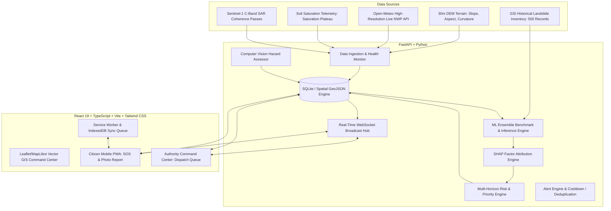

# AI-Based Early Warning & Landslide Risk Monitoring System for North Eastern Region (NER)

### SIH 2026 | Problem Statement 26001 | Ministry of Development of North Eastern Region (MDoNER)

---

## 1. Executive Summary & Problem Overview
The North Eastern Region (NER) of India—spanning **Assam, Arunachal Pradesh, Manipur, Meghalaya, Mizoram, Nagaland, Sikkim, and Tripura**—presents extreme geomorphological vulnerability to rainfall-triggered landslides and slope collapse. Steep terrain, fragile lithology (Disang shales, Tertiary sandstones, phyllites), high seismicity, and intense monsoons (>150mm/24h cloudbursts) regularly paralyze strategic national highways (NH-27, NH-10, NH-29, NH-13), severing remote communities and incurring heavy casualties.

This platform is a **production-grade disaster intelligence and early warning system** engineered for **decision-making**, not mere visualization. Grounded in recent peer-reviewed landslide-AI literature (*Loke et al., Natural Hazards 2026; Sharma & Laskar, IJAPE 2025; Kakad et al. 2025*), the platform provides:

1. **Multi-Horizon Landslide Forecasting**: Real-time and forward-looking predictions (Now, +6h, +12h, +24h, +48h, +72h).
2. **Terrain Conditioning & Saturation Plateau Engine**: Heavy weighting of Slope & Aspect (#1 & #2 conditioning factors) with non-linear handling of soil moisture saturation (~70% field capacity threshold).
3. **Transparent Explainability (XAI)**: SHAP-driven factor contribution vectors answering *"Why is this risk increasing?"*.
4. **Emergency Priority Engine (EPS)**: Computes $P1$ to $P4$ intervention tiers combining Risk Probability, Population Exposure, Infrastructure Criticality, Road Lifeline Vulnerability, and Catchment Impact.
5. **Real-Time Dual-Persona Workflows**:
   - **Authority Command Center**: Interactive MapLibre/Leaflet GIS command post, Sentinel-1 SAR change detection swipe, priority dispatch queue, and automated government alert dispatches.
   - **Public & Field Officer Mobile PWA**: Low-bandwidth offline-first incident reporter with AI Computer Vision photo triage, instant GPS SOS beacon, and vernacular support.

---

## 2. Research Foundation & Scientific Grounding

Our engineering architecture is directly grounded in recent empirical findings:

* **Model Selection is Region-Dependent (Loke, Kho & Raghunandan, *Natural Hazards* 2026)**:
  Benchmarking across 95 landslide-AI papers proved tree-based ensembles (Random Forest, Gradient Boosting) outperform single linear/SVM baselines on tropical monsoon terrain. Our platform runs an automated 4-model benchmark suite (`ml/benchmark.py`) validating performance across Random Forest, Gradient Boosting, Logistic Regression, and Two-Stage Feature-to-Risk pipelines.
* **Slope & Aspect as Dominant Conditioning Factors**:
  Slope angle and slope aspect consistently ranked #1 and #2 among conditioning factors ahead of rainfall in spatial susceptibility mapping. Terrain derivatives are computed from 30m SRTM/Copernicus DEM.
* **Soil Moisture as the Primary Triggering Proxy (Sharma & Laskar, *IJAPE* 2025)**:
  IoT sensor studies established that soil moisture correlates strongest ($R^2$) to slope failure and plateaus near ~70% saturation capacity. Our feature transformation explicitly models this saturation inflection to avoid false alarms in low-lying valley basins.
* **Overcoming Connectivity Gaps (Kakad et al. 2025)**:
  Offline-first local storage and mesh packet queueing ensure field reporting and SOS triggers continue operating when cellular connectivity fails in remote mountain gorges.

---

## 3. System Architecture & Tech Stack



- **Frontend**: React 19, TypeScript, Vite, Tailwind CSS v4, Leaflet GIS, Recharts, Lucide Icons.
- **Backend**: FastAPI, Python 3.14, Uvicorn, Pydantic v2, SQLite / PostGIS-compatible schemas, Pillow.
- **ML / AI**: scikit-learn, joblib, numpy, scipy.

---

## 4. Key Features & Capabilities

| Feature | Description |
| :--- | :--- |
| **Multi-Horizon Timeline Slider** | Dynamically visualizes risk evolution from Now, +6h, +12h, +24h, +48h, to +72h. |
| **Emergency Priority Scoring (EPS)** | Mathematical ranking ($0-100$) assigning $P1-P4$ tiers for tactical intervention. |
| **SHAP "Why This Risk?" Attribution** | Percentage breakdown of top drivers (Steep Slope, 72h ARI, Soil Saturation, Lithology). |
| **AI Computer Vision Photo Triage** | Instant edge-energy & soil-exposure analysis of citizen-submitted hazard photos with geotechnical disclaimers. |
| **Real-Time SOS Incident Command** | Instant radar-pulsing beacon on map with lifecycle status tracking (New $\to$ Dispatched $\to$ Resolved). |
| **Strategic Highway Lifeline Status** | Real-time monitoring of NH-27, NH-10, NH-29, NH-37, NH-6, NH-13 with traffic advisories & alternate routes. |
| **Sentinel-1 SAR Swipe Comparison** | Interactive Before vs After satellite split-view displaying surface deformation zones. |
| **Interactive SIH Scenario Mode** | 6-step controlled simulation walking through monsoon surge, risk elevation, road blockage, and SOS response. |
| **Multilingual Vernacular Support** | English, Hindi (हिन्दी), Assamese (অসমীয়া), Manipuri (মৈতৈলোন্), Mizo (Mizo ṭawng), and Bengali (বাংলা). |

---

## 5. Quick Start & Setup Guide

### Prerequisites
- Python 3.10+
- Node.js v18+ and npm

### 1. Start the FastAPI Backend
```bash
# In project root:
python -m ml.benchmark     # Trains and benchmarks ML models
python -m uvicorn backend.main:app --host 0.0.0.0 --port 8000 --reload
```
API Documentation will be live at `http://localhost:8000/docs`.

### 2. Start the React Frontend
```bash
cd frontend
npm install
npm run dev
```
Open `http://localhost:5173` in your browser.

---

## 6. Running the Automated Test Suite

```bash
# Run backend API integration tests
python -m pytest tests/test_api.py

# Run frontend TypeScript build verification
cd frontend
npm run build
```

---

## 7. Data Provenance & Scientific Honesty
All platform metrics maintain strict labels:
- `[OBSERVED]`: In-situ telemetry & Open-Meteo actual observations.
- `[FORECAST]`: Numerical weather prediction models.
- `[MODEL PREDICTION]`: ML landslide susceptibility and trigger classification.
- `[SIMULATION]`: Controlled scenario demonstration mode.
